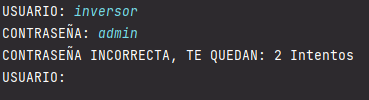
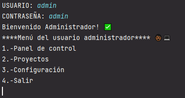
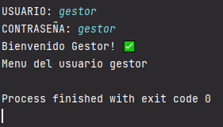
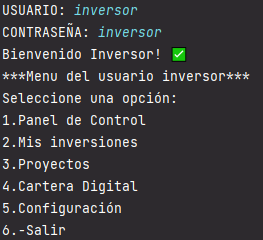

En esta práctica hemos realizado un sistema de acceso a distintos tipos de usuarios:

Tenemos que ingresar los datos correctos y nos mostrará dependiento del usuario disntintos menús, los usuarios son: admin, gestor y inversor.

---MENÚ DEL ADMINISTRADOR---

Aquí se muestran distintas acciones que puede realizar el administrador.

---MENÚ DEL GESTOR---

---MENÚ DEL INVERSOR---

---REQUISITOS PARA PODER EJECUTAR EL PROGRAMA---

1º Un entorno de desarrollo integrado.

2º Tener java instalado en nuestro equipo.

3º Cuando tengamos todo instalado y el programa lo unicó que tendra que hacer es darle a ejecutar.

